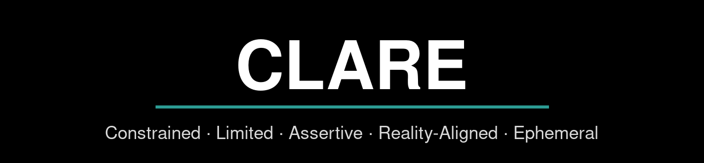
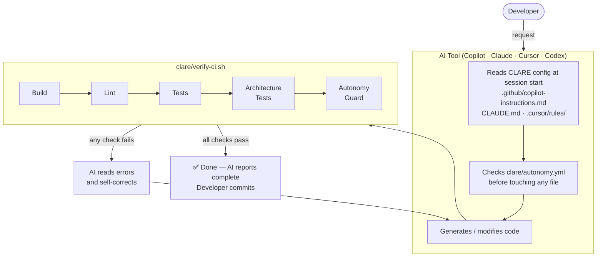

[](https://github.com/jketreno/clare/actions/workflows/ci.yml)

# CLARE — AI-Assisted Development Framework

> **C**onstrained · **L**imited · **A**ssertive · **R**eality-Aligned · **E**phemeral

The counterintuitive part of AI-assisted development:

> **More constraints = more autonomy.**
>
> The tighter you define the boundaries, the more you can safely delegate. Loose boundaries mean you're reviewing everything because anything could break anything.
>
> This feels backwards until you try it.

Your architecture rules live in code reviews and tribal knowledge. AI can't read any of that — so it generates code that works but violates your patterns.

CLARE fixes this: define your rules as automated checks, tell the AI to run them before finishing, and let it self-correct. The AI generates code, runs `verify-ci.sh`, sees the failure, fixes it, and reports done — you never see the violation.

Works with GitHub Copilot, Claude Code, Cursor, Codex, and MCP-compatible agent frameworks.

Want to know the thought process that led to CLARE's design? Read the [origin story](ORIGIN.md).

---

## CLARE in 60 seconds

1. Install CLARE into your repo with one script.
2. AI tools read CLARE rules (`AGENTS.md`, `CLAUDE.md`, `.github/*`, `.cursor/rules/*`) automatically, honoring AI editing limits.
3. Before claiming work is done, AI must run `./clare/verify-ci.sh`.
4. If checks fail, AI fixes and reruns until all pass.
5. You review constraints and architecture, not repetitive implementation mistakes.

---

## Quick Start

### 1 — Install CLARE into your project

<!-- RELEASE_VERSION_START -->
**Latest release: [v1.4.0](https://github.com/jketreno/clare/releases/tag/v1.4.0)**

```bash
curl -fsSLO https://github.com/jketreno/clare/releases/download/v1.4.0/clare-installer-v1.4.0.sh
chmod +x ./clare-installer-v1.4.0.sh
./clare-installer-v1.4.0.sh --target /path/to/your-project
```
<!-- RELEASE_VERSION_END -->

This copies CLARE's scripts, AI tool configs, and templates into your project. If CLARE is already installed, the installer updates CLARE-owned files and preserves your customizations.

It then runs the setup wizard, which uses a hybrid flow: it can install a safe starter `clare/autonomy.yml`
and guide you to run the `autonomy-bootstrap` skill from your AI assistant
(Cursor, Copilot Chat, Claude, Codex, etc.) to generate project-specific boundaries and sources of truth.
Manual prompts for boundaries/concepts are still available as a fallback.

### 2 — See it work

```bash
./clare/verify-ci.sh
```

You should see all checks pass. This is the script your AI tool runs before reporting any work as complete. Right now it checks autonomy boundaries and shell compliance. Your project-specific checks come next.

### 3 — Confirm your autonomy boundaries

Open `clare/autonomy.yml` and review module levels (`full-autonomy`, `supervised`, `humans-only`) for your project. Keep high-risk areas conservative first, then relax specific low-risk paths after review.

### 4 — Add your first constraint

Open your AI tool (Copilot, Claude Code, Cursor, Codex) in your project. It automatically reads the CLARE config files installed in step 1. Paste this:

```
Analyze this codebase and identify the build tools, linters, test frameworks,
and any existing architecture tests. For each tool found, show me the exact
run_check() line to add to clare/verify-local.sh. Wait for my approval.
```

Review what the AI proposes, approve it, then run `./clare/verify-ci.sh` again — your checks are now enforced.

### 5 — Turn a code review comment into an enforced rule

Think of your most repeated code review comment. Tell your AI tool:

```
I want to turn this code review rule into an enforced constraint:
"[paste your most common review comment here]"

What type of check best enforces this — linter rule, architecture test, or build flag?
Show me the code for the check and the run_check() line for clare/verify-local.sh.
Wait for my approval.
```

From now on, AI self-corrects against that rule before saying "done." You review constraints, not implementations.

---

## How It Works



The core rule every AI config enforces:

> **Run `./clare/verify-ci.sh` before reporting work as complete. If it fails, fix the issues and run again. Never say "done" if it fails.**

---

## The Five Principles

| # | Principle | What it means |
|---|-----------|---------------|
| **C** | **Constrained** | Architecture rules are enforced by scripts and tests, not code review |
| **L** | **Limited** | Modules are tagged `full-autonomy`, `supervised`, or `humans-only` |
| **A** | **Assertive** | Tests enforce what must always be true, not just confirm the current implementation |
| **R** | **Reality-Aligned** | Domain models derive from a declared single source of truth |
| **E** | **Ephemeral** | Generated code is regenerated from source, never hand-edited |

---

## What Gets Installed

The installer copies these into your project:

```
clare/
  verify-ci.sh          — The enforcement script (CLARE-owned, updated automatically)
  verify-local.sh       — Your project-specific checks (never overwritten)
  autonomy.yml          — Module boundaries (full-autonomy / supervised / humans-only)
  extensions.yml        — Optional tool extensions (ESLint / golangci-lint / complexipy complexity checks)
  principles.md         — AI quick-reference card (read at session start)
  templates/
    architecture-tests/ — Autonomy guard test (copy into your test suite)
    skills/             — AI skills (autonomy bootstrap, MCP server scaffolding, code review)
    linting/            — ESLint config templates (flat, legacy, React/TSX)
    git-hooks/          — Pre-commit hook that runs verify-ci.sh
    github-actions/     — CI/CD workflow template
  examples/             — Domain-specific examples (available separately)
  docs/                 — Agentic workflows & MCP integration guide

AGENTS.md              — Codex config (auto-read at session start)
CLAUDE.md              — Claude Code config (auto-read at session start)
.github/               — GitHub Copilot instruction files
.cursor/rules/         — Cursor MDC rule files
.claude/commands/      — Claude slash commands (/project:verify, check-autonomy, update-autonomy)
.vscode/               — VS Code tasks, settings, recommended extensions
```

Domain-specific examples (API endpoint skills, type-sync tests, etc.) are available separately:

```bash
# Extract examples on demand (outside onboarding):
./clare-installer-vX.Y.Z.sh --install-examples /path/to/examples
```

---

## Updating CLARE

When a new version is released, run the installer again against the same project:

```bash
curl -fsSLO https://github.com/jketreno/clare/releases/download/vX.Y.Z/clare-installer-vX.Y.Z.sh
bash clare-installer-vX.Y.Z.sh --update --target /path/to/your-project
```

CLARE-owned files (`verify-ci.sh`, AI configs, `principles.md`) are updated. Your files (`verify-local.sh`, `autonomy.yml`, `extensions.yml`) are never overwritten.

---

## Optional Extension Tool Installs (macOS / Linux / WSL)

When you enable an extension in `clare/extensions.yml`, `./clare/verify-ci.sh` checks that the tool exists and prints the extension's `install_hint` if it is missing.

If you hit setup or PATH issues, see [TROUBLESHOOTING.md](TROUBLESHOOTING.md).

### Supported host environments

- macOS: fully supported
- Linux: fully supported
- Windows: recommended via WSL2 (Ubuntu or similar) with Bash

CLARE scripts are Bash-first. You can run on native Windows with custom setup, but WSL is the tested and recommended path.

### TypeScript / JavaScript complexity (ESLint)

Extension name: `eslint-complexity`

Install requirements:

```bash
# from your project root
npm install --save-dev eslint
```

Notes:

- Use Node + npm from your normal project toolchain.
- With ESLint v9, ensure you have a flat config file (`eslint.config.js` / `eslint.config.mjs` / `eslint.config.cjs`).

### Go complexity (golangci-lint)

Extension name: `golangci-lint-complexity`

Install requirements:

```bash
# requires a working Go toolchain first
go install github.com/golangci/golangci-lint/cmd/golangci-lint@latest
```

Notes:

- Ensure your Go bin directory is on PATH (commonly `$(go env GOPATH)/bin` or `~/go/bin`).
- CLARE enforces threshold settings for `cyclop` and `gocognit` when this extension is enabled.

### Python complexity (complexipy)

Extension name: `complexipy-complexity`

Install requirements:

```bash
# preferred
pipx install complexipy

# alternative inside your project's Python environment
pip install complexipy
```

Notes:

- `pipx` is recommended for a clean global CLI install.
- If you install via `pip`, use the same Python environment your CI/automation uses.

### Bash/shell complexity (shellmetrics)

Extension name: `shellmetrics-complexity`

Install requirements:

```bash
mkdir -p ~/bin
curl -fsSL https://git.io/shellmetrics -o ~/bin/shellmetrics
chmod +x ~/bin/shellmetrics
```

Notes:

- Ensure `~/bin` is on PATH.
- You can pass parser flags via extension `extra_flags` (for example `--shell bash`).

### Quick verification

After installing tools and enabling extensions:

```bash
./clare/verify-ci.sh
```

If a required command is still missing, verify PATH and rerun.

---

## Alternative: Bootstrap from Source

If you prefer to work from the git repo (for contributing or customizing CLARE itself):

```bash
git clone https://github.com/jketreno/clare
cd clare
./scripts/clare-installer.sh /path/to/your-project                        # install + setup wizard
./scripts/clare-installer.sh --install-examples /path/to/examples         # extract domain-specific examples
./scripts/clare-installer.sh --dry-run /path/to/project                   # preview only
./scripts/clare-installer.sh --update --target /path/to/project           # update an existing CLARE install
```

Use `--update` when re-running against a project that already has CLARE installed.

---

## Learn More

| Topic | Document |
|-------|---------|
| Origin & philosophy | [ORIGIN.md](ORIGIN.md) |
| Full setup walkthrough | [docs/getting-started.md](docs/getting-started.md) |
| Troubleshooting | [TROUBLESHOOTING.md](TROUBLESHOOTING.md) |
| Enforcement with tests | [docs/principles/constrained.md](docs/principles/constrained.md) |
| Autonomy boundaries | [docs/principles/limited.md](docs/principles/limited.md) |
| Generated code workflows | [docs/principles/ephemeral.md](docs/principles/ephemeral.md) |
| Writing constraint tests | [docs/principles/assertive.md](docs/principles/assertive.md) |
| Sources of truth | [docs/principles/reality-aligned.md](docs/principles/reality-aligned.md) |
| VS Code / Copilot setup | [docs/ai-tools/vscode-copilot.md](docs/ai-tools/vscode-copilot.md) |
| Claude Code setup | [docs/ai-tools/claude.md](docs/ai-tools/claude.md) |
| Cursor setup | [docs/ai-tools/cursor.md](docs/ai-tools/cursor.md) |
| Codex setup | [docs/ai-tools/codex.md](docs/ai-tools/codex.md) |
| Agentic workflows & MCP | [docs/agentic.md](docs/agentic.md) |
| Contributing | [DEVELOPERS.md](DEVELOPERS.md) |
