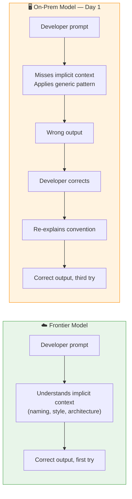
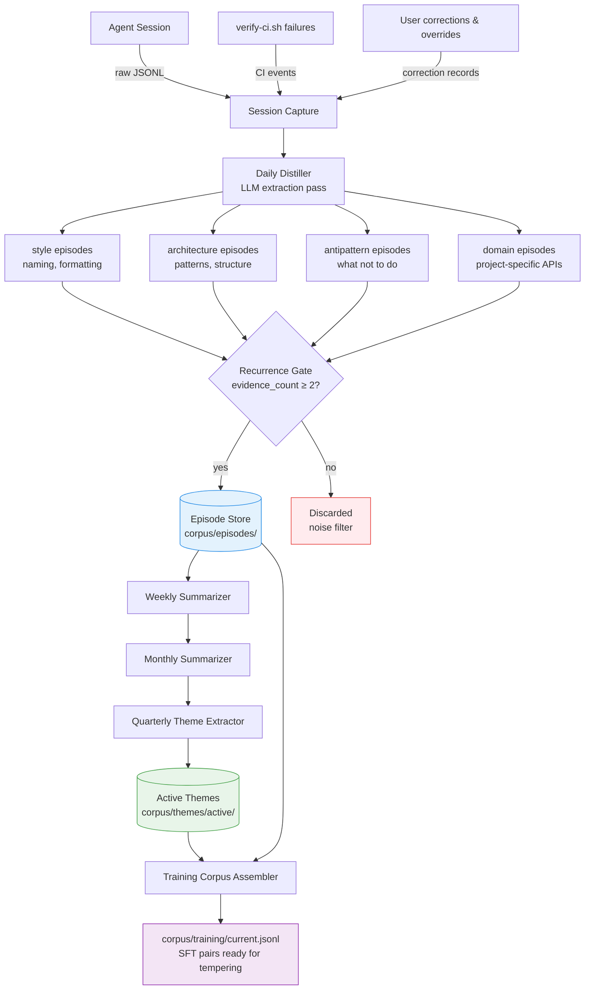
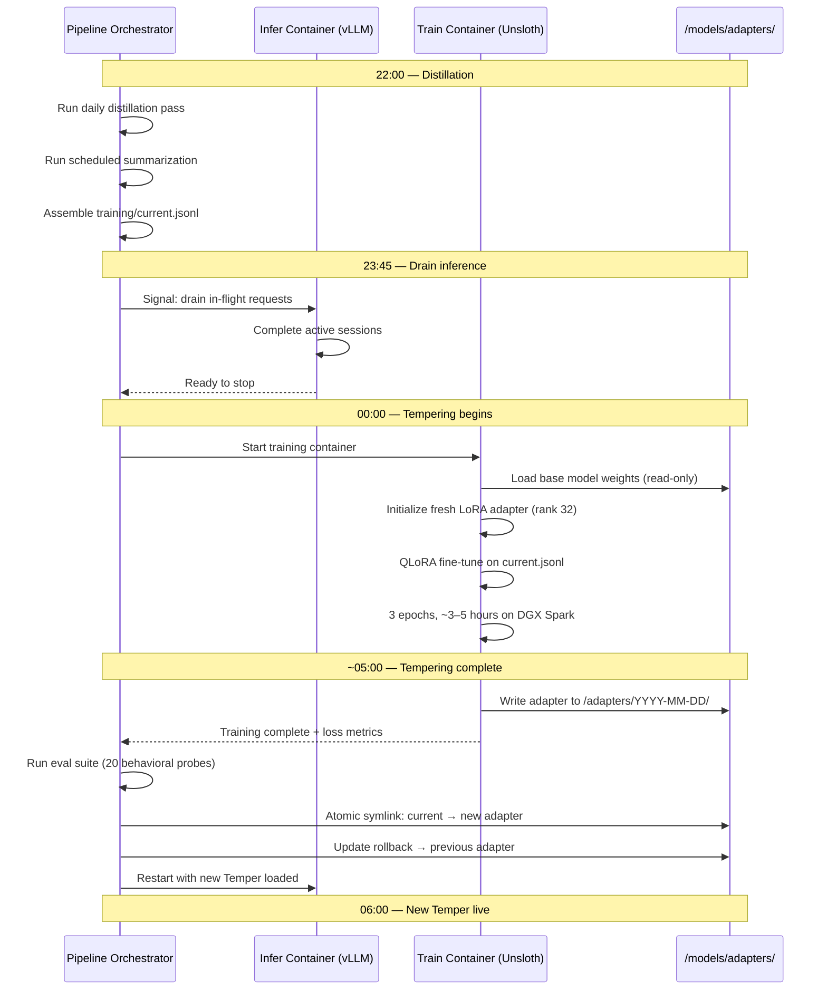
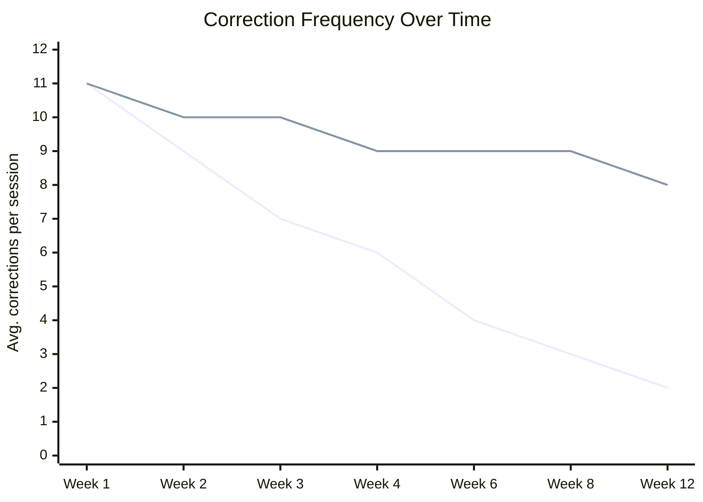
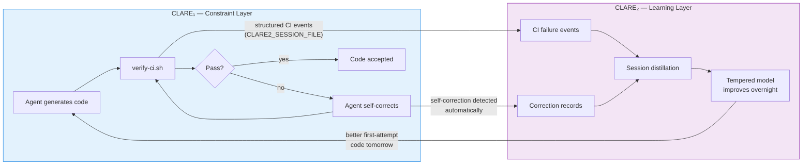

# The Tempered Model: How CLARE₂ Makes On-Prem AI Remember Who You Are

> *A smaller model that knows you is more useful than a larger model that has to be reminded every morning.*

---

On-premise AI deployments come with a trade. You get data sovereignty, predictable latency, and freedom from API rate limits. What you give up is scale — the frontier models that understand a casual aside like "make this more idiomatic" or "keep it consistent with the rest of the codebase" without needing three paragraphs of explanation are the ones living in a data center you don't own. The models you *can* run locally — the 7B to 32B range that fits on a DGX Spark or a well-specced workstation — are capable, but they lose nuance. They answer the literal question when you meant the contextual one. They apply the textbook pattern when your project has an established deviation from it. They make you re-explain things you explained last Tuesday.

CLARE₂ is designed to close that gap — not by making the model bigger, but by making it *yours*.

---

## The Nuance Problem in On-Prem Models

Smaller models are not simply slower versions of larger ones. They differ qualitatively in a specific way that matters for developer tooling: **they have shorter contextual reach**. A 70B model can hold a mental model of your codebase, your naming conventions, and the architectural direction of the last three files it saw — all at once. A 14B model reads each exchange more literally. Ask it to "refactor this to match our pattern" and it will ask what pattern. Ask the 70B the same question after seeing five files and it will infer.

This creates friction that compounds. The developer learns to compensate: write longer prompts, include more examples, explain conventions that should be implicit. That compensation takes time and concentration. It also defeats much of the purpose of having an AI coding assistant at all.

The corrections in that loop are not wasted — they are data. Every re-explanation, every rename, every "no, use the factory pattern, not the singleton" is a precisely labeled example of the gap between what the model assumed and what you actually meant. CLARE₂ captures that data. It distills it. And every night, it trains it into the model's weights so that tomorrow, the gap is smaller.

---

## Introducing the Tempered Model

The name for the nightly-refreshed artifact in CLARE₂ is the **Temper** — short for *tempered model*, and deliberately chosen for its metallurgical meaning.

In metalworking, tempering is the process that follows hardening. You take steel that's been hardened (strong but brittle), then heat and cool it in controlled cycles to relieve internal stress and refine its grain structure. The result is steel that keeps its strength but gains resilience — it responds predictably to force rather than shattering under it. A tempered blade holds an edge under use.

The analogy is precise:

| Metallurgy | CLARE₂ |
|---|---|
| Base steel alloy | Pre-trained base model (Qwen2.5-Coder-32B) |
| Hardening | General pre-training — makes the model capable but general |
| Tempering cycle | Nightly QLoRA fine-tuning pass |
| Grain refinement | Behavioral patterns distilled from your sessions |
| Tempered blade | The Temper — model tuned to your project's specific character |
| Repeated heating | Each nightly cycle, adapter reset and retrained from accumulated corpus |

The Temper is not a different model. It is the same base model viewed through a LoRA adapter that has been shaped by your working patterns — reset and recast each night from the distilled corpus of everything you and your team have taught it.

Colloquially, a person's *temper* is their characteristic disposition. That meaning holds too. The Temper has your project's disposition baked in.

---

## How CLARE₂ Builds the Temper

CLARE₂ operates in two phases that run on different timescales: the **distillation pipeline** (continuous, daytime) and the **tempering cycle** (nightly).

### The Distillation Pipeline

The recurrence gate is the key filter. A single session can produce noise — a developer fighting an unusual bug will generate corrections that are specific to that bug, not to their general preferences. Only patterns that appear more than once within a session, or that recur across multiple sessions, earn a place in the episode store. Patterns that don't recur are progressively compressed away through the weekly and monthly summarization cycles. What survives to the quarterly theme extractor is only what has proven stable over time.

### The Tempering Cycle

Each tempering cycle starts from the base model — the LoRA adapter is not accumulated from the previous night, it is recast entirely from the current corpus. This is the architectural decision that prevents drift and makes the system auditable: the Temper is always a pure distillate of what the corpus currently contains, not a stack of incremental patches on patches.

---

## What the Temper Actually Learns

The gap between a generic on-prem model and a tempered one is most visible in four categories of nuance that smaller models reliably miss.

### 1. Naming Conventions

A generic model applies textbook casing: `camelCase` for JavaScript, `snake_case` for Python. Your project may use `snake_case` for everything, or prefix private methods with `_`, or name error types with an `Err` suffix rather than `Error`. These conventions exist nowhere in the base model's training data — they're yours.

**Generic model:** Asked to add a method, produces `getUserData()`.
**Tempered model:** Has seen you rename to `get_user_data` three times this month. Produces `get_user_data` unprompted.

### 2. Architectural Preferences

Which patterns your project uses — and deliberately avoids — is not documented anywhere a base model can read. You may have decided against dependency injection in favor of explicit imports. You may use a specific error-handling pattern across all async functions. You may have a module boundary that should never be crossed.

**Generic model:** Suggests a repository pattern because it's the canonical answer.
**Tempered model:** Has seen the repository pattern rejected twice in CI. Proposes the direct service pattern your codebase uses.

### 3. Anti-Patterns Specific to Your Stack

Every codebase accumulates a list of things that look fine in isolation but break something in your specific environment — a library interaction, a runtime constraint, a deployment requirement. These are the things that trigger the same CI failure three weeks apart because no one remembered to document them.

**Generic model:** Suggests `async/await` wrapping a synchronous operation that your event loop can't handle.
**Tempered model:** Has seen that exact CI failure twice. Avoids it.

### 4. Domain Vocabulary

The names your team uses for domain concepts — entities, services, flows — often differ from what a base model would infer from the code alone. "Customer" vs "Client" vs "Account." "Fulfillment" vs "Order processing." Getting these wrong in generated code creates review friction even when the logic is correct.

**Generic model:** Uses generic domain terms inferred from surrounding code.
**Tempered model:** Has absorbed your team's vocabulary through session observation. Uses your terms consistently.

---

## The Experience Curve

One of the properties that makes the Temper valuable for on-prem deployments is that it improves *as the team works* — not as a configuration task, but as a side effect of normal development.

*Top line: generic on-prem model (corrections plateau; the model never learns). Bottom line: Tempered model (corrections decline as the corpus matures).*

The first two weeks are the cold-start period — the corpus is thin and the Temper is underfit. Context injection (a lean `CLAUDE.md`) carries the load here. By week four, the most common friction patterns have been observed enough times to pass the recurrence gate and enter training. By week eight, the model has internalized the major conventions and architectural preferences. By week twelve, the correction rate approaches what a developer would expect from a frontier model — achieved not by scaling up the model, but by shaping it.

---

## The On-Prem Advantage

The irony of the nuance problem is that on-prem deployments are actually better positioned to solve it than cloud deployments. A cloud API model cannot retain state between sessions. A local model can be retrained nightly on data that never leaves your infrastructure.

```mermaid
graph TB
    subgraph Cloud["☁️ Cloud API Model"]
        CA[Session begins]
        CB[Load MEMORY.md / context]
        CC[Developer re-explains conventions]
        CD[Session ends]
        CE[Memory discarded]
        CA --> CB --> CC --> CD --> CE
        CE -.->|"Next session: start over"| CA
    end

    subgraph OnPrem["🖥️ On-Prem + CLARE₂"]
        OA[Session begins]
        OB[Temper already knows your conventions]
        OC[Developer works — corrections captured]
        OD[Session ends]
        OE[CLARE₂ distills corrections]
        OF[Tempering cycle runs]
        OG[Tomorrow's Temper is better]
        OA --> OB --> OC --> OD --> OE --> OF --> OG
        OG -.->|"Next session: improved baseline"| OA
    end

    style Cloud fill:#fff3e0,stroke:#fb8c00
    style OnPrem fill:#e8f5e9,stroke:#43a047
```

Every session a developer has with a cloud model is training data that belongs to someone else's model. Every session with a Tempered on-prem model is training data that makes your model better — and stays on your hardware.

This also changes the calculus for model size selection. An on-prem team comparing a 14B model to a 32B model should not be comparing only their raw benchmark scores. They should be comparing *32B + six weeks of tempering* against *14B + six weeks of tempering*. The tempered 14B may outperform the generic 32B on your specific codebase. The tempered 32B will likely outperform the generic 70B for your domain tasks specifically.

---

## Integration with CLARE₁

CLARE₂ sits inside the CLARE₁ framework as a learning layer, not a replacement for constraint enforcement. CLARE₁'s `verify-ci.sh` loop is the highest-signal source of training data — it produces labeled examples of exactly what the model did wrong and exactly what the correct behavior looked like (the self-correction that passed CI).

The integration is intentionally minimal — a single environment variable (`CLARE2_SESSION_FILE`) enables structured event emission from `verify-ci.sh`. When unset, CLARE₁ behaves identically to its current form. When set, every CI failure, self-correction, and autonomy-tier event flows into the CLARE₂ distillation pipeline automatically.

The feedback loop this creates is the core value proposition: CLARE₁ makes the model's failures visible. CLARE₂ ensures the model learns from them. Neither system is meaningful without the other; together they produce a model that improves at the pace your team works.

---

## Getting a Temper

The cold start is manageable. During the first two weeks while the corpus matures:

- A lean `CLAUDE.md` carries the conventions the Temper hasn't learned yet. Think of it as the scaffolding that comes down as the structure self-supports.
- Category weights are configurable — if naming conventions are the dominant source of friction in week one, weight the `style` category higher until the Temper stabilizes.
- The weekly digest surfaced by the pipeline shows which themes entered training this week and which patterns are still below the recurrence gate, giving the team visibility into what the Temper currently knows.

By week six, most teams find the `CLAUDE.md` has shrunk significantly — not because they deleted it, but because they stopped needing to add to it. The things that would have gone into `CLAUDE.md` went into the corpus instead, and from the corpus into the Temper's weights. The model carries them without being reminded.

That's the point. A model that has to be reminded every morning is a model you're managing. A Tempered model is a model that's working with you.

---

## Summary

On-prem AI deployments face a genuine nuance gap relative to frontier cloud models. Smaller models miss contextual signals that larger models infer. The developer compensates with longer prompts, repeated explanations, and constant correction — friction that compounds and erodes the value of the tooling.

CLARE₂ treats that friction as data. Through daily session capture, structured distillation, and nightly QLoRA fine-tuning, it builds a **Temper** — a LoRA adapter shaped by your project's specific conventions, architectural preferences, anti-patterns, and vocabulary. The Temper is reset and recast each night from the accumulated corpus, making it an auditable, resettable distillate of everything the model has learned from your team.

The result is not a bigger model. It's a model that knows where it is.

---

*CLARE₂ is part of the open CLARE suite. CLARE₁ (Constrained Limited Assertive Reality-aligned Ephemeral) provides the constraint enforcement framework. CLARE₂ (Contextual Learning and Automated Reasoning Engine) provides the learning substrate. Together they answer the two hard questions in production AI agents: how do you keep it honest, and how do you keep it from being a stranger every morning.*
